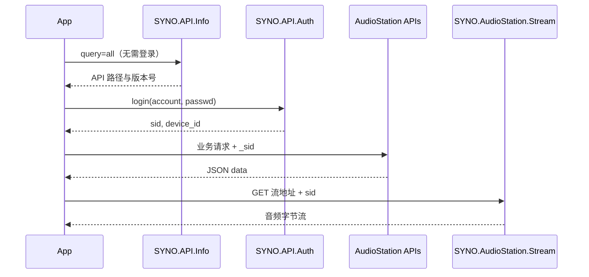

# AvMusic

基于 **Avalonia** 的跨平台音乐播放器，通过群晖 **Audio Station** Web API 访问 NAS 上的音乐库，在 Windows、macOS、Linux、Android、iOS 与 Browser 上提供统一的浏览与播放体验。

> API 细节与抓包示例见仓库内 [`ApiDocuments/`](ApiDocuments/)（含 [`群晖开发文档.md`](ApiDocuments/群晖开发文档.md) 与 `Response/` 下的 JSON 样例）。

---

## 目标与范围

| 类别 | 说明 |
|------|------|
| **核心目标** | 连接群晖 NAS → 登录 DSM → 浏览/搜索音乐 → 流式播放 → 基础播放控制 |
| **数据源** | 仅 Audio Station（非本地文件扫描、非第三方流媒体） |
| **架构** | MVVM，UI 与 Synology API / 播放引擎解耦 |
| **平台** | 沿用现有多目标项目：Desktop / Android / iOS / Browser |

### MVP（第一阶段交付）

- 服务器配置与登录（含 HTTPS、自签名证书处理）
- 会话保持与过期重登
- 浏览：最喜欢的（5星歌曲）、歌曲列表、专辑、艺术家、文件夹、类型、播放列表、最近添加、最常播放、最近播放、歌词页面（封面、歌曲信息、歌词）
- 搜索（`SYNO.AudioStation.Search`）
- 流式播放（`SYNO.AudioStation.Stream`）+ 封面（`SYNO.AudioStation.Cover`）
- 迷你播放条：播放/暂停、上一首/下一首、进度、音量
- 收藏/评级（`song_rating` + `setrating`）

### 后续迭代（非 MVP）

- Pin 主页快捷项、播放列表增删改、歌词显示
- 标签编辑（`webman/3rdparty/.../tag_editor.cgi`）
- 离线缓存、后台播放、系统媒体控件
- 均衡器（依赖 `SYNO.AudioStation.Info` 返回能力）

---

## 技术栈

| 层次 | 选型 |
|------|------|
| UI | Avalonia 11.x + Fluent 主题 |
| MVVM | ReactiveUI（项目已引用） |
| 运行时 | .NET 10 |
| HTTP | `HttpClient` + 可选 `IHttpClientFactory` |
| JSON | `System.Text.Json`（源生成器可选） |
| 音频播放 | **LibVLCSharp** 或 **NAudio**（跨平台需验证 Browser；Desktop/移动优先 LibVLC） |
| 本地配置 | `SecureStorage` / 平台密钥链 + 加密 JSON |
| 日志 | `Microsoft.Extensions.Logging` |

---

## 解决方案结构（规划）

当前为 Avalonia 模板，建议按职责拆分为类库，便于测试与复用：

```
AvMusic/
├── AvMusic/                    # 共享 UI + ViewModels + App
├── AvMusic.Core/               # 领域模型、接口（无 UI 依赖）【新建】
├── AvMusic.Synology/           # 群晖 API 客户端、DTO、认证【新建】
├── AvMusic.Audio/              # 播放引擎抽象与实现【新建】
├── AvMusic.Desktop/
├── AvMusic.Android/
├── AvMusic.iOS/
├── AvMusic.Browser/
├── ApiDocuments/               # 本地 API 文档与响应样例（只读参考）
└── README.md
```

### 分层职责

```
┌─────────────────────────────────────────┐
│  Views (AXAML)                          │
├─────────────────────────────────────────┤
│  ViewModels (ReactiveUI)                │
├─────────────────────────────────────────┤
│  Services (应用编排：登录、库浏览、播放队列) │
├──────────────┬──────────────────────────┤
│ AvMusic.     │ AvMusic.Audio            │
│ Synology     │ IPlaybackEngine          │
├──────────────┴──────────────────────────┤
│ AvMusic.Core (Song, Album, Session…)    │
└─────────────────────────────────────────┘
```

---

## 群晖 API 集成设计

### 1. 基础 URL

```
https://{host}:{port}/webapi/{path}
```

- 默认 HTTPS 端口：`5001`（HTTP 常为 `5000`）
- `path` 来自 `SYNO.API.Info` 返回的各 API 元数据（见 `ApiDocuments/Response/00 - api.json`）

### 2. 调用流程



### 3. 认证（待实现时对照官方文档）

文档样例中业务 API 需会话；`00 - api.json` 已包含 `SYNO.API.Auth`（maxVersion 7）。

典型登录载荷（实现阶段需用真实 NAS 验证）：

| 参数 | 说明 |
|------|------|
| `api` | `SYNO.API.Auth` |
| `method` | `login` |
| `version` | 使用 Info 返回的 maxVersion |
| `account` / `passwd` | 用户名密码 |
| `session` | 如 `AudioStation` |
| `format` | `sid` |

响应中的 `sid` 作为后续请求的 `_sid` 查询参数（或 Cookie，以实现为准）。错误码见 [`群晖开发文档.md` 返回代码一节](ApiDocuments/群晖开发文档.md)（如 `106` 会话超时、`403` 需 2FA）。

### 4. 已文档化的 Audio Station API

以下与 [`群晖开发文档.md`](ApiDocuments/群晖开发文档.md) 及 `Response/` 样例对齐：

| API | 用途 | 文档章节 |
|-----|------|----------|
| `SYNO.API.Info` | 发现 API 版本与 path | § SYNO.API.Info |
| `SYNO.AudioStation.Info` | 服务能力、权限 | § Info |
| `SYNO.AudioStation.Song` | 歌曲列表/详情/评级/随机 | § Song |
| `SYNO.AudioStation.Album` | 专辑列表 | § Album |
| `SYNO.AudioStation.Artist` | 艺术家 | § Artist |
| `SYNO.AudioStation.Folder` | 文件夹浏览 | § Folder |
| `SYNO.AudioStation.Genre` | 类型 | § Genre |
| `SYNO.AudioStation.Playlist` | 播放列表 CRUD | § Playlist |
| `SYNO.AudioStation.Pin` | 主页固定项 | § Pin |
| `SYNO.AudioStation.Lyrics` | 歌词 | § Lyrics |
| `SYNO.AudioStation.Search` | 搜索 | § 搜索 |
| `SYNO.AudioStation.MediaServer` | 媒体服务器 | § MediaServer |
| `SYNO.AudioStation.Stream` | **音频流** | api.json |
| `SYNO.AudioStation.Cover` | **封面图** | api.json |

公共请求参数（多数 list 接口）：`limit`、`offset`、`method`、`library`（`all` / `shared`）、`additional`、`version`、`sort_by`、`sort_direction`。

### 5. 流媒体与封面 URL（实现时验证）

实现阶段在 NAS 上抓包确认，预期形态类似：

```
GET /webapi/AudioStation/stream.cgi?id={songId}&_sid={sid}
GET /webapi/AudioStation/cover.cgi?id={songId}&_sid={sid}
```

播放器使用 **完整 URL** 打开流；大文件（FLAC）建议支持缓冲与 Range（取决于群晖与播放器能力）。

### 6. 数据模型映射

JSON 样例中歌曲结构（见 `04 - 所有音乐.json`）：

- 顶层：`id`、`title`、`path`、`type`
- `additional.song_tag`：专辑、艺术家、年份、流派等
- `additional.song_audio`：时长、码率、codec
- `additional.song_rating`：评分（0–5，用于「喜欢」）

领域层 `Song` 由 DTO 映射，ViewModel 仅暴露 UI 所需字段。

### 7. 已知注意事项（来自文档）

- 搜索结果的歌曲 **可能不含** `song_rating`，「喜欢」列表宜用评级接口或本地标记辅助。
- 添加歌曲到播放列表时，重复项会返回 `411`，需 `skip_duplicate=true`。
- 含中文或特殊字符的参数需 `Uri.EscapeDataString`。
- 自签名证书：开发期可配置 `HttpClientHandler.ServerCertificateCustomValidationCallback`（发布版应支持导入 CA 或证书指纹固定）。

---

## UI 功能模块（规划）

| 模块 | 视图 | 主要 ViewModel |
|------|------|----------------|
| 欢迎/登录 | `LoginView` | `LoginViewModel` |
| 服务器设置 | `ServerSettingsView` | `ServerSettingsViewModel` |
| 主页 | `HomeView` | `HomeViewModel`（Pin、最近专辑） |
| 音乐库 | `LibraryView` | 子页：全部歌曲 / 专辑 / 艺术家 / 文件夹 / 类型 |
| 专辑详情 | `AlbumDetailView` | `AlbumDetailViewModel` |
| 播放列表 | `PlaylistView` | `PlaylistViewModel` |
| 搜索 | `SearchView` | `SearchViewModel` |
| 播放器 | `PlayerBar` + `NowPlayingView` | `PlayerViewModel` |
| 设置 | `SettingsView` | `SettingsViewModel` |

导航：桌面端 `SplitView` 或左侧 `NavigationView`；移动端底部 Tab + 全屏播放页。

---

## 实现步骤（分阶段）

请确认下列阶段与优先级后，再开始编码。

### 阶段 0：工程基线（约 0.5 天）✅

- [x] 新建 `AvMusic.Core`、`AvMusic.Synology`、`AvMusic.Audio` 类库并加入解决方案引用
- [x] 引入 `Microsoft.Extensions.DependencyInjection`、`Logging`、`HttpClient`
- [x] 配置 DI 入口（`AppServices` + `App.axaml.cs`）
- [x] 统一 `Nullable`（`Directory.Build.props`）

### 阶段 1：Synology 客户端（约 2–3 天）✅

- [x] `SynologyApiClient`：`HttpClient` 封装、BaseUrl、超时、证书策略
- [x] `ApiInfoService`：拉取并缓存 `SYNO.API.Info`
- [x] `AuthService`：登录、登出、`SynologyApiException`
- [x] `StreamUrlBuilder`：流/封面 URL 构建
- [x] `AudioStationService`：Song / Album / Artist / Folder / Genre / Playlist / Search / Lyrics
- [x] DTO + `System.Text.Json` 反序列化（与 `ApiDocuments/Response` 对齐）
- [x] 单元测试：`AvMusic.Synology.Tests`（`ApiDocuments/Response` 样例）

### 阶段 2：音频播放（约 1–2 天）✅

- [x] `IPlaybackEngine`：Load、Play、Pause、Seek、Volume、Position/Duration 事件
- [x] `LibVlcPlaybackEngine`（Desktop）+ `StubPlaybackEngine`（其他平台回退）
- [x] `StreamUrlBuilder` + `MusicPlayerService` 编排
- [x] `PlaybackQueue`：顺序 / 列表循环 / 单曲循环 / 随机
- [ ] Desktop 实机 NAS 流播放验证（需登录后手动测试）

### 阶段 3：MVVM 与登录（约 1–2 天）✅

- [x] `ServerSettings` 持久化（`%AppData%/AvMusic/settings.json`，Windows DPAPI 保护密码）
- [x] `LoginView` + `LoginViewModel`（ReactiveUI 命令、验证、错误提示）
- [x] `AppShellViewModel`：未登录显示登录页，已登录显示 `HomeView`
- [x] `ISessionState` + 退出登录
- [x] 会话过期（106/119）API 调用时自动登出（`LibraryPageBase`）

### 阶段 4：音乐库 UI（约 3–4 天）✅

- [x] 主导航 shell（左侧导航 + 内容区 + 底部播放条）
- [x] 全部歌曲（分页加载更多）、专辑、艺术家列表
- [x] 专辑详情 → 曲目列表 → 点击播放 / 播放全部
- [x] 文件夹浏览、类型 → 专辑列表
- [x] `CoverCacheService`（已实现，列表封面 UI 待阶段 5 增强）
- [x] 搜索页（歌曲/专辑/艺术家）

### 阶段 5：播放器 UI（约 1–2 天）✅

- [x] 底部 `PlayerBarView`（封面、进度、控制按钮）
- [x] 全屏 `NowPlayingView`（点击封面/标题打开，可关闭）
- [x] 进度条拖动 Seek（松开时跳转）
- [x] 音量调节
- [x] 喜欢/评级（`setrating` 0/5，★/☆ 切换）

### 阶段 6：播放列表与 Pin（约 1–2 天）

- [ ] 播放列表列表与详情
- [ ] 创建/删除/重命名、添加/移除歌曲
- [ ] Pin 列表展示（主页）

### 阶段 7：平台与体验（约 2–3 天）

- [ ] Android/iOS 后台播放与通知栏（各平台项目）
- [ ] 网络断开、重试、加载状态
- [ ] 主题（浅色/深色）、本地化资源（中文优先）
- [ ] Browser 目标评估（播放与 CORS 限制）

### 阶段 8：质量与发布（持续）

- [ ] 集成测试（可选：Testcontainers 不适用；使用录制响应）
- [ ] 崩溃日志、匿名使用统计（可选）
- [ ] 打包：Desktop MSIX/安装包、移动端商店配置

---

## 本地开发

### 环境要求

- .NET 10 SDK
- 可访问的群晖 NAS（已安装 Audio Station）
- 可选：Visual Studio 2022 / Rider / VS Code + C# Dev Kit

### 构建与运行

```bash
# 在仓库根目录（含 Directory.Packages.props）
dotnet build AvMusic.Desktop/AvMusic.Desktop.csproj
dotnet run --project AvMusic.Desktop/AvMusic.Desktop.csproj
```

其他目标：

```bash
dotnet build AvMusic.Android/AvMusic.Android.csproj
dotnet build AvMusic.iOS/AvMusic.iOS.csproj
dotnet build AvMusic.Browser/AvMusic.Browser.csproj
```

### 配置 NAS 测试账号

1. 在 DSM 创建专用测试用户，仅授予 Audio Station 所需权限。
2. 控制面板 → 登录门户 → 高级：确认 API/应用程序登录已允许。
3. 若启用 2FA，MVP 可先使用「应用程序专用密码」或阶段 1 扩展 OTP 流程（错误码 403/404）。

---

## 依赖包（计划引入）

| 包 | 用途 |
|----|------|
| `Microsoft.Extensions.DependencyInjection` | DI |
| `Microsoft.Extensions.Http` | 命名 HttpClient |
| `LibVLCSharp` + 平台原生包 | 跨平台解码播放 |
| `CommunityToolkit.Mvvm` 或保持 ReactiveUI | 命令/属性（二选一，建议沿用 ReactiveUI） |
| `SkiaSharp`（可选） | 封面缩放 |

具体版本在阶段 0 写入 `Directory.Packages.props`。

---

## 风险与对策

| 风险 | 对策 |
|------|------|
| API 版本因 DSM 版本而异 | 启动时 `SYNO.API.Info` 动态取 maxVersion |
| 证书不受信任 | 首次连接展示指纹，用户确认后固定 |
| 曲库过大，一次拉取超时 | 分页 + 虚拟化列表（UI 虚拟izing） |
| 搜索无 rating | 喜欢列表用 `song_rating_meq` 或本地集合 |
| Browser 无法直接播 NAS 流 | MVP 排除或经代理；优先 Desktop/移动 |
| 2FA | 二期支持 OTP；MVP 文档说明限制 |

---

## 文档索引

| 文件 | 内容 |
|------|------|
| [`ApiDocuments/群晖开发文档.md`](ApiDocuments/群晖开发文档.md) | 中文 API 说明、载荷示例、错误码 |
| [`ApiDocuments/Response/`](ApiDocuments/Response/) | 真实响应 JSON，用于 DTO 设计与测试 |
| [`ApiDocuments/发布Log.txt`](ApiDocuments/发布Log.txt) | 历史发布备注 |

---

## 确认事项（实施前请回复）

1. **产品名称**：仓库为 `AvMusic`，历史日志有「Loon」— 最终显示名以哪个为准？AvMusic
2. **MVP 平台**：是否先只做 **Desktop**，再扩展 Android/iOS？可以
3. **播放引擎**：LibVLC vs NAudio，是否有偏好？LibVLC
4. **2FA**：测试 NAS 是否开启？MVP 是否必须支持？
5. **阶段优先级**：是否同意按「阶段 0 → 1 → 2 → 3 → 4 → 5」顺序推进？同意

**确认后即可从阶段 0 开始提交代码。**

---

## 许可证

待定（请补充开源协议或保留专有声明）。
